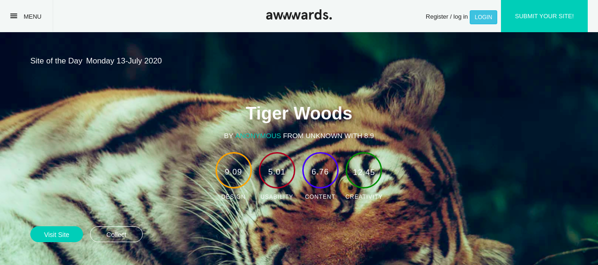

### AWWARDS

### By Cecilia Barasa

### Description
This is an application that allows users to post a project he/she has created to get reviewed by other users.

### Preview

# Setup and installation requirements
* `Virtual environment`
* `pip install -r requirements.txt`

# Technologies used
* `Python3.6.9`
* `Django3.0.7`
* `HTML`
* `CSS`
* `JAVASCRIPT`

### 

## [Support and contact details](https://www.linkedin.com/in/cecilia-barasa-4a8311195/)
